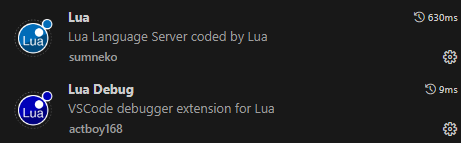
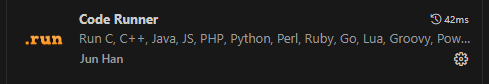
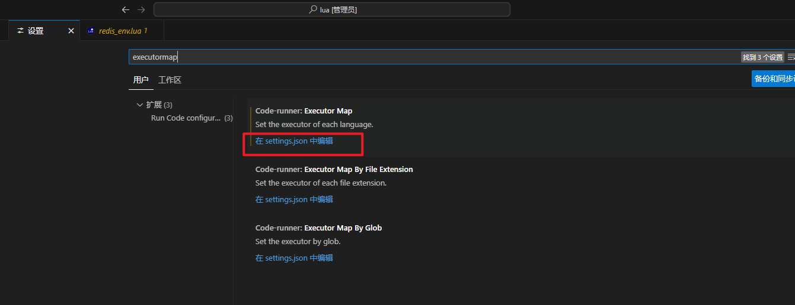
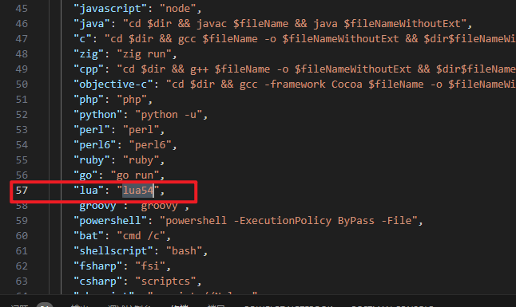
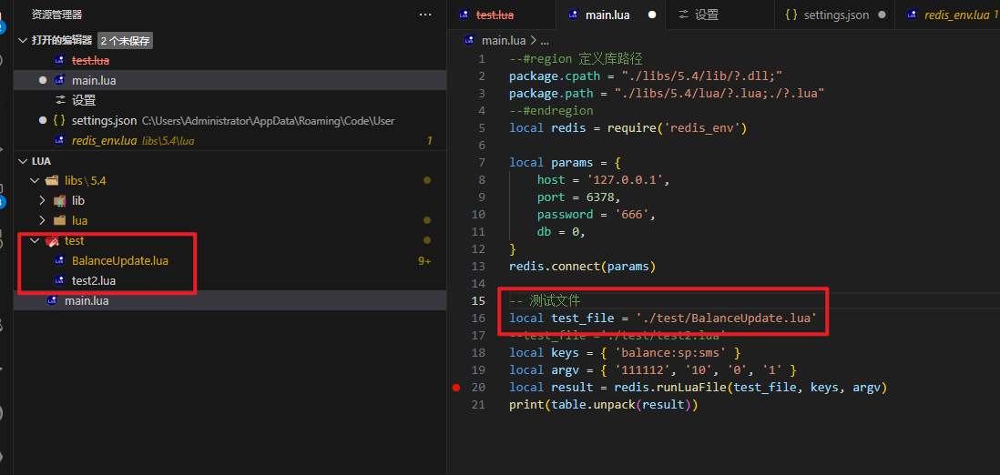
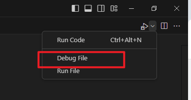

# Redis Lua 调试方式

此文档用于描述如何配置环境以调试 Redis Lua

## 1. 环境需求

+ lua 5.4
+ VSCode
+ + 插件:
+ + Lua
+ + Lua Debug
+ + Code Runner

## 1.1 lua5.4 安装

解压 本文档下的 [lua54.zip](./docs/lua5.4.zip) 到合适位置

将他的目录配置到环境变量中（配置新环境变量后需要新开终端才可加载）

## 1.2 VSCode 插件配置

先在VSCode中安装相关插件：

配置 Code Runner：

在 VSCode 的设置中搜索 `executorMap` 然后点击 `在settings.json中编辑`

找到 `lua` 的配置，将值更换为绝对路径或者命令

## 2. 运行以及调试

打开 `main.lua` 配置其中的 redis 信息，修改测试文件路径

点击右上角的运行按钮，找到debug或者run，进行调试或者运行

## 3. 注意事项

相关依赖的库都放入到了 [libs](libs) 中，通过 `main.lua` 文件开头的 `cpath` 和 `path` 引入

lua 的 Redis 实现源自 [hnimminh/luaredis](https://github.com/hnimminh/luaredis)，但做了部分修改，因为其行为有部分可能与 Redis 中的`redis.call` 命令不一致

另外，redis 中使用的 lua 版本是 5.1，部分lua库函数可能不一致如 `unpack` 方法 变为了 `table.unpack` 方法，在 [redis_env.lua](./libs/redis/redis_env.lua) 中的沙箱环境中已做兼容